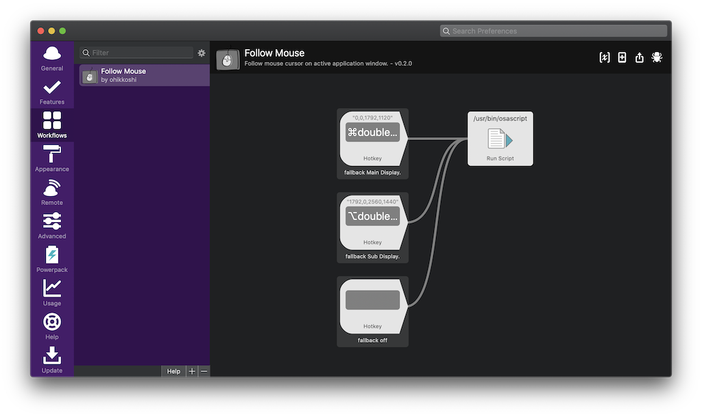
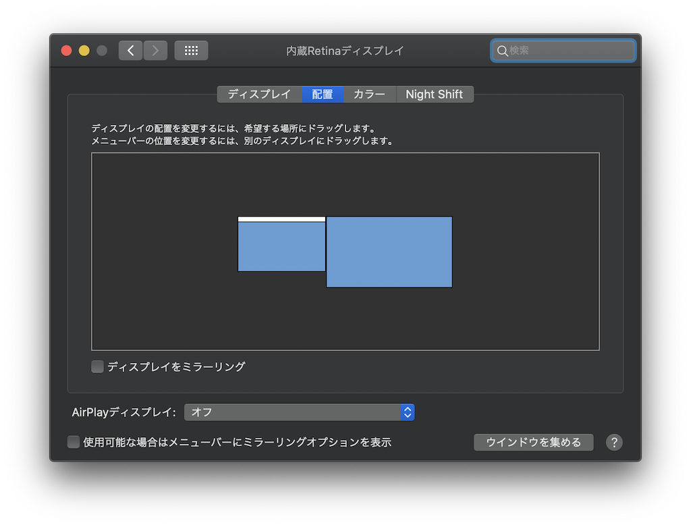
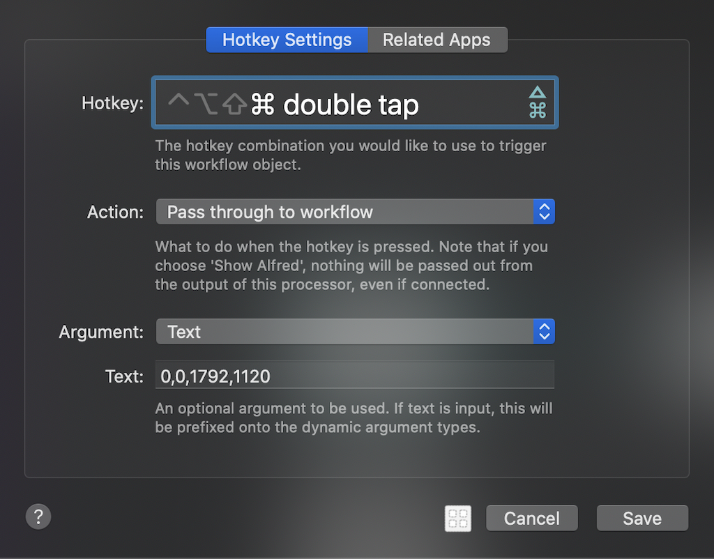
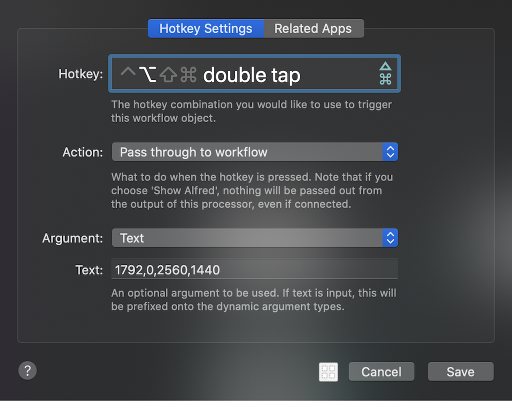
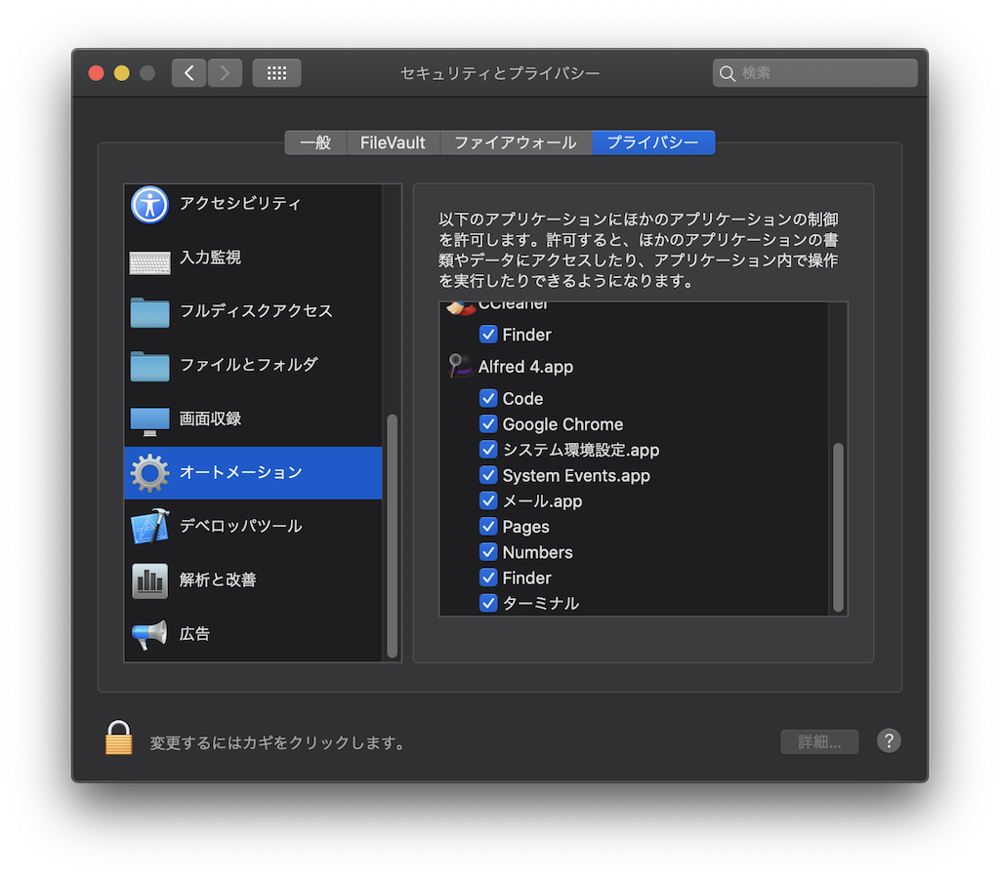

# FollowMouse for Alfred4 Workflow
アクティブなアプリケーションウィンドウにマウスカーソルを移動するAflred4用Workflowスクリプトです。

Follow mouse cursor on active application window.

## Usage
ディスプレイの座標と解像度をホットキーの引数に指定することで
osascriptに非対応のアプリケーションではディスプレイの中心にマウスカーソルを移動します。

Specify display coordinates and resolution in hotkey arguments.

For applications that do not support osascript
Will move to the display specified as the fallback.

e.g.

| Main Display | Sub Display |
| --- | --- |
|  |  |

ウィンドウ情報を取得する際にセキュリティの許可を求められた場合は
[システム環境設定]-[セキュリティとプライバシー]-[オートメーション]のAlfred4.appにチェックをつけてください。

If you are asked for security permission when acquiring window information, check Alfred4.app in [System Preferences]-[Security & Privacy]-[Automation].

## Links
* https://www.alfredforum.com/topic/9413-move-mouse-pointer-to-currently-activefocused-window/
* https://chy72.hatenablog.com/entry/2016/10/12/153822

## Thanks
* https://tosurai.com/about2

